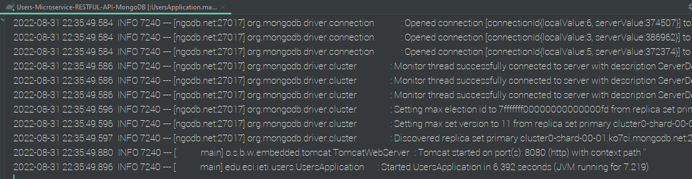

# (Users-Microservice-RESTFUL-API)Spring Boot Security with JWT


In this practice...

IETI - LAB03

2022-2.


## Development

This project is the continuation of the project 

[ Users-Microservice-RESTFUL-API - Data MongoDB ](https://github.com/ZulyVargas/Users-Microservice-RESTFUL-API-MongoDB.git) 


and is developed following the steps of the following repository

[ Spring Boot Security with JWT ](https://github.com/CAPJackie/spring-boot-jwt) 

#### Project structure


### Prerequisites


* [Gradle](https://gradle.org) - Management tool used for projects build, dependency and documentation. 
* [Java ](https://www.oracle.com/co/java/technologies/javase/javase-jdk8-downloads.html)     - Programming language and computing platform.


### Installing

To download the project run:

  ```bash
    git clone https://github.com/ZulyVargas/Users-Microservice-JWT.git
  ```

Run in Users-Microservice-JWT:

```bash
    gradle build
    gradlew bootRun
```
If you have problems, run the application from your editor of choice, suggest: **IntelliJ**.

It is necessary to add the environment variable that allows the connection to the database in the cluster of the mongodb account.


 

***Example***




## Running the tests

### Part 1: Adding Security Configuration:

+ Open Endpoint: User's List. Should return all registered users no problem.


+ Secured Endpoint: User by Id. Should not be allowed to obtain the result of the request. 


## Built With

* [IntelliJ IDEA](https://www.jetbrains.com/help/idea/discover-intellij-idea.html) - Integrated development environment written in Java for developing computer software.
* [Gradle](https://gradle.org) - Management tool used for projects build, dependency and documentation.
* [Java ](https://www.oracle.com/co/java/technologies/javase/javase-jdk8-downloads.html)     - Programming language and computing platform.

## Authors

* **Zuly Valentina Vargas Ramírez** 